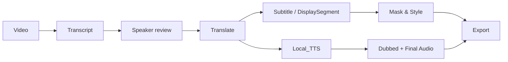
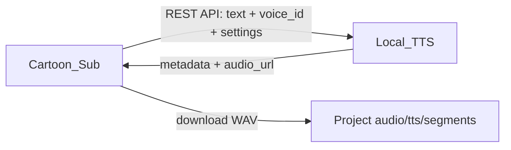

# Cartoon Sub

Ứng dụng desktop Windows cho quy trình làm phụ đề, dịch Trung–Việt, lồng tiếng và render video. Cartoon Sub quản lý project, timeline, speaker, bản dịch, phụ đề, vị trí TTS, audio mix và video đầu ra; FFmpeg xử lý media cục bộ.

> Trạng thái: dự án đang phát triển, hướng đến Windows 10/11. Hãy giữ bản sao project và kiểm tra đầu ra trước khi xuất bản.

## Tính năng

### Project và video

- Tạo/mở project cục bộ, lưu trạng thái atomically trong `project.json` (schema hiện tại: v3).
- Kiểm tra media bằng ffprobe trước khi tạo project: video phải có video stream và audio stream.
- Báo riêng trường hợp video không có âm thanh; không gọi FFmpeg extraction hoặc Gemini transcript.
- Trích audio nguồn mono PCM16 16 kHz bằng FFmpeg, có hash/manifest để tái sử dụng.
- Artifact do ứng dụng tạo nằm trong project; video nguồn có thể tiếp tục là file ngoài project.

### Transcript

- Import SRT tiếng Trung mà không gọi AI, hoặc tạo/tiếp tục transcript audio bằng Google Gemini.
- Transcript dài trên 120 giây dùng cửa sổ audio 75 giây, overlap 2 giây, khử trùng lặp ở biên và checkpoint theo chunk.
- Retry có backoff cho lỗi tạm thời, gồm HTTP 429/503; chunk hoàn tất được giữ để Resume.
- Structured JSON được kiểm tra timestamp, nội dung và speaker trước khi thay master timeline.
- Phát hiện overlap và đề xuất speaker; người dùng review, đổi tên, gán, gộp/tách và nghe từng dòng.

### Speaker và Master Dialogue Timeline

- `Utterance` là câu thoại nguồn/canonical, chứa timing, speaker, Chinese, `VI Subtitle` và `VI Dubbing`.
- Master Dialogue Timeline cho phép sửa bản Việt, mode/target âm tiết, áp dụng hoặc hoàn tác chỉnh sửa tay và tối ưu dubbing.
- Hồ sơ speaker ánh xạ `speaker_id` sang voice Local_TTS và tốc độ đọc.
- Timeline giữ overlap hợp lệ giữa các speaker.

### Dịch

- Phân tích ngữ cảnh thành hồ sơ nhân vật, quan hệ, thuật ngữ và quy tắc xưng hô; hồ sơ đề xuất phải được người dùng áp dụng.
- Hỗ trợ chọn nhiều context profile, custom context, glossary/mapping và nhiều chế độ tên riêng.
- Provider dịch/ngữ cảnh: Google Gemini, OpenAI, Anthropic Claude, OpenRouter, DeepSeek, Groq, Mistral AI, Together AI, Fireworks AI và xAI.
- Dịch theo chunk có cache/checkpoint, resume phần lỗi; QC không tự sửa nội dung.
- Import SRT tiếng Việt theo timing; dữ liệu import được đánh dấu nguồn và không bị AI âm thầm ghi đè.
- `VI Subtitle` ưu tiên nội dung hiển thị; `VI Dubbing` có thể được tối ưu riêng cho thời lượng đọc/TTS.

### Subtitle

- Tách rõ `Utterance` (nội dung/timing nguồn) và `DisplaySegment` (cách trình bày phụ đề).
- Auto Segment toàn bộ hoặc các câu chọn; split, merge, reset thủ công và QC tốc độ đọc/dòng/ký tự.
- Có thể căn timing audio cho các câu chọn; giữ nguyên nội dung bản dịch.
- Hỗ trợ presentation nhiều lane khi speaker overlap và nhãn speaker theo chế độ.
- Xuất `zh.srt`, `vi.srt`, `vi_dubbing.srt` và ASS dùng khi render.

### Mask và style

- Hai kiểu mask thực tế: `solid` và `gaussian`.
- Solid dùng màu mask do người dùng chọn; Gaussian giữ blur và không dùng màu mask.
- Chỉnh font, size, bold, alignment, outline, shadow, màu chữ và màu viền; preview không sửa subtitle thật.
- Chọn vùng mask trực tiếp trên frame, căn phụ đề vào mask nếu cần.
- Logo hỗ trợ vị trí, kích thước/scale, rotation, transparency; watermark chữ có style riêng.
- Preview 10 giây trước khi render.

### Audio và dubbing

- Kết nối hoặc tự khởi động Local_TTS; test health và tải voice `READY` qua REST API.
- Danh sách voice ưu tiên favorites, preview voice và gán voice/tốc độ theo speaker hoặc theo batch speaker đã chọn.
- `Generate / Resume TTS` dùng `VI Dubbing`, tải WAV từ `audio_url`, kiểm tra WAV và lưu project-relative tại `audio/tts/segments/`.
- Fingerprint TTS gồm text, voice, speed và Local_TTS server identity; cue hợp lệ được tái sử dụng, cue stale/failed được tạo lại.
- Căn thời lượng TTS vào slot timeline, giữ overlap và tạo `audio/tts/dubbed_mix.wav`.
- Audio mixer trộn audio gốc, dubbed audio và optional additional audio với volume/start offset thành `audio/final_audio.wav`.
- Play/Stop Final Audio ngay trong tab Audio.

### Export và khả năng phục hồi

- Render test tối đa 30 giây từ mốc chọn hoặc render toàn bộ video.
- Export video yêu cầu `audio/final_audio.wav` hợp lệ và không stale.
- Xuất SRT/TXT/manifest theo speaker mà không sửa master timeline.
- Job dài có progress/cancel; thao tác hủy giữ checkpoint đã hoàn thành.
- Undo/Redo dùng chung cho các chỉnh sửa UI đã hỗ trợ; `Ctrl+S` lưu project.
- Cửa sổ **Docs** tích hợp giải thích workflow và lỗi thường gặp.

## Workflow



## Kiến trúc

```text
PySide6 UI
  └─ Controller
      ├─ ProjectManager / ProjectPaths
      ├─ transcription + speaker
      ├─ translation + context + QC
      ├─ subtitle segmentation + renderer
      ├─ Local_TTS HTTP client + TTS generation
      └─ FFmpeg audio/video mix + export
```

Các module chính:

- `src/cartoon_sub/app/`: entrypoint, settings và điều phối workflow.
- `src/cartoon_sub/project/`: storage, migration, atomic save và cache helpers.
- `src/cartoon_sub/transcription/`, `speaker/`: transcript, checkpoint và speaker review.
- `src/cartoon_sub/translation/`: context profile, glossary, dịch, dubbing optimization và QC.
- `src/cartoon_sub/subtitle/`: models, segmentation, timing, SRT/ASS và render.
- `src/cartoon_sub/tts/`: REST client, generation cache, placement/mix và final audio.
- `src/cartoon_sub/media/`: ffprobe/FFmpeg, preview và video render.
- `src/cartoon_sub/ui/`: các tab/dialog PySide6, progress/cancel và undo.

## Tích hợp Local_TTS

Local_TTS là backend tùy chọn: chỉ cần khi tạo lồng tiếng. Các bước transcript, import/dịch/subtitle/mask vẫn có thể dùng mà không chạy Local_TTS.



Cartoon Sub gọi health, voice list/detail, preview, generate và audio download. Client ưu tiên `audio_url` cùng origin; `audio_path` chỉ là fallback tương thích local. Cartoon Sub không phụ thuộc thư mục `outputs` của Local_TTS.

Xem [README của Local_TTS](../TTS_Sub/Local_TTS/README.md). Nếu publish thành hai GitHub repository độc lập, thay link này bằng URL public.

## Yêu cầu

- Windows 10/11 là môi trường mục tiêu hiện tại.
- Python `>=3.11`.
- `ffmpeg` và `ffprobe` có trong `PATH`.
- Gemini API key khi dùng transcript audio; API key provider tương ứng khi dùng dịch/ngữ cảnh AI.
- Local_TTS tại URL mặc định `http://127.0.0.1:8765` khi dùng dubbing.

Dependencies Python được khai báo trong `pyproject.toml`: PySide6, pysubs2, python-dotenv, keyring, google-genai và httpx.

## Cài đặt

Trong PowerShell tại repository:

```powershell
py -3.11 -m venv .venv
.\.venv\Scripts\python.exe -m pip install --upgrade pip
.\.venv\Scripts\python.exe -m pip install -e .
ffmpeg -version
ffprobe -version
```

Chạy GUI:

```powershell
.\.venv\Scripts\cartoon-sub.exe
```

Hoặc:

```powershell
.\.venv\Scripts\python.exe -m cartoon_sub.app.main
```

Trên Windows cũng có thể nhấp đúp [Cartoon_Sub_GUI.pyw](Cartoon_Sub_GUI.pyw) sau khi môi trường đã được cài.

## Quick start

1. Mở tab **Video**, chọn video có cả hình và tiếng, rồi chọn thư mục project mới.
2. Ở **Transcript**, import Chinese SRT hoặc cấu hình Gemini và chạy transcript.
3. Review và xác nhận speaker.
4. Ở **Translate**, chọn context/văn phong/glossary, áp dụng hồ sơ rồi dịch hoặc import Vietnamese SRT.
5. Ở **Subtitle**, auto segment và xử lý QC.
6. Ở **Mask**, lấy frame, chọn vùng mask và style, sau đó preview.
7. Nếu cần dubbing, chạy Local_TTS, gán voice, Generate/Resume, Build Dubbed Audio và Build Final Audio.
8. Ở **Export**, render test 30 giây rồi render `final.mp4`.

## Thiết lập AI

1. Lấy Gemini API key tại [Google AI Studio](https://aistudio.google.com/apikey).
2. Mở **Settings → AI…**, chọn model/provider, nhập key và bấm nút test tương ứng.
3. Lưu settings. Key được lưu bằng OS keyring; môi trường phát triển có thể dùng `.env` hoặc biến như `GEMINI_API_KEY`, `OPENAI_API_KEY`.

Không commit `.env` hoặc API key. Test metadata Gemini không đảm bảo request inference có quota/quyền đầy đủ.

## Cấu trúc project

```text
<ProjectRoot>/
├── project.json
├── source/                         # video có thể vẫn là external path
├── audio/
│   ├── source.wav                  # PCM16 mono 16 kHz
│   ├── source.json                 # hash/profile audio extraction
│   ├── final_audio.wav
│   └── tts/
│       ├── segments/               # WAV TTS project-relative
│       └── dubbed_mix.wav
├── transcription/
├── translation/
├── cache/
│   ├── transcription/
│   ├── translation/
│   └── tts/previews/
├── subtitle/
│   ├── zh.srt
│   ├── vi.srt
│   ├── vi_dubbing.srt
│   ├── segments.json
│   └── translation_review.json
├── preview/                        # frame và preview jobs
├── output/                         # render jobs từ tab Mask
├── exports/
├── tts_export/                     # SRT/TXT/manifest snapshot theo speaker
├── logs/
├── .tmp/export/                    # staging tạm
├── test_30s.mp4                    # Export test
└── final.mp4                       # Export hoàn chỉnh
```

Các thư mục được tạo sẵn có thể đang rỗng. Không sửa tay cache/checkpoint khi ứng dụng chạy. Artifact từ server được sao chép vào project; `project.json` lưu đường dẫn TTS tương đối để project có thể di chuyển.

## Cache, resume và recovery

- Audio source dùng source hash + extraction profile.
- Transcript/dịch lưu checkpoint theo content/model/prompt; Resume bỏ qua chunk đã hoàn tất.
- TTS cache kiểm tra fingerprint và WAV thực tế trước khi reuse.
- Thay text, voice, speed, server, timeline hoặc audio settings sẽ đánh dấu artifact liên quan stale.
- Save project và nhiều output quan trọng dùng temp + atomic replace; project schema cũ được migrate và backup khi cần.

Chi tiết: [Project, cache và tiếp tục công việc](docs/CACHE_RESUME.md).

## Phím tắt

| Phím | Tác dụng |
| --- | --- |
| `Ctrl+S` | Lưu project |
| `Ctrl+Z` | Undo thao tác UI được hỗ trợ |
| `Ctrl+Y` hoặc `Ctrl+Shift+Z` | Redo |

## Troubleshooting

- **Video không có âm thanh**: chọn lại file có audio stream; app dừng trước extraction/transcript.
- **FFmpeg/ffprobe không chạy**: kiểm tra hai executable trong `PATH`; đường dẫn Unicode/khoảng trắng được truyền bằng argument list.
- **Gemini 401/403**: kiểm tra key, quyền API và model.
- **Gemini 404**: model không khả dụng cho project/key; chọn model hiện có trong Settings.
- **Gemini 429**: quota hết hoặc rate limit; Resume sau khi quota phục hồi.
- **Gemini 503/5xx**: dịch vụ tạm thời lỗi; long transcript tự retry có backoff và giữ checkpoint.
- **Local_TTS không kết nối**: kiểm tra URL, port, trạng thái model và executable đã chọn; chỉ chạy một instance trên port đó.
- **Voice không READY**: chọn voice READY hoặc validate/enable voice trong Local_TTS.
- **Final audio stale/missing**: Build Dubbed Audio rồi Build Final Audio trước Export.
- **File WAV bị khóa**: dừng playback trước khi rebuild; process ngoài vẫn có thể giữ file.

## Tài liệu

- [Mục lục](docs/INDEX.md)
- [Hướng dẫn sử dụng](docs/USER_GUIDE.md)
- [Master Dialogue Timeline](docs/MASTER_TIMELINE.md)
- [Dịch theo ngữ cảnh](docs/PHASE3_TRANSLATION.md)
- [Subtitle segmentation](docs/subtitle/SEGMENTATION.md)
- [Mask, style và render](docs/PHASE5_MASK_STYLE.md)
- [Audio và Local_TTS](docs/AUDIO.md)
- [Cache và resume](docs/CACHE_RESUME.md)

## Portable ZIP / Chuyển sang máy khác

Cartoon_Sub hiện **chưa có** PyInstaller `.spec`, build script hoặc `Cartoon_Sub.exe` được định nghĩa/kiểm thử. Build mode thật là chạy từ source qua Python `>=3.11`; vì vậy chưa thể gọi ZIP hiện tại là binary standalone. Source-transfer sang PC khác phải mang `pyproject.toml`, `Cartoon_Sub_GUI.pyw`, toàn bộ `src/cartoon_sub/` (gồm assets/prompts), rồi tạo venv và `pip install .` trên máy đích.

`ffmpeg` và `ffprobe` không được bundle và phải có trong `PATH`. Font subtitle cũng lấy từ Windows. Local_TTS có thể auto-discover một số layout source tương đối; cách chắc chắn sau khi chuyển là **Audio → Select Local_TTS…**, chọn `Local_TTS.exe`, rồi **Test connection** tại `http://127.0.0.1:8765`.

Khuyến nghị stage ngoài repo tại `C:\release\Cartoon_Sub_Source_v0.3.0`, không kèm `.venv`, `.env`, tests, Git metadata, project/media/cache/log cá nhân. Dữ liệu project đặt riêng, ví dụ `C:\CartoonSuite\Projects`, không đặt trong `src`, `.venv` hoặc `_internal` tương lai.

Guide chi tiết gồm bảng REQUIRED/OPTIONAL/PRIVATE/DEV, source-transfer commands, separate/combined ZIP, setup PC mới, smoke test đường dẫn khác và portability blockers: [docs/PORTABLE.md](docs/PORTABLE.md).

### BEFORE ZIP

- [ ] Build Release (hiện Cartoon_Sub chưa có binary build)
- [ ] Remove secrets, `.env`, project và media cá nhân
- [ ] Verify Local_TTS assets
- [ ] Verify FFmpeg/ffprobe trong PATH
- [ ] Verify resource/relative paths
- [ ] Smoke test staging folder tại đường dẫn khác
- [ ] Create ZIP và calculate SHA256
- [ ] Test ZIP after extraction

### TARGET PC

- [ ] Extract to writable folder
- [ ] Install Python 3.11+ cho source-transfer hiện tại
- [ ] Install FFmpeg/ffprobe
- [ ] Configure API key trong Settings
- [ ] Start/Test Local_TTS
- [ ] Start Cartoon_Sub
- [ ] Create a test project ngoài app folder
- [ ] Preview one TTS voice

## Source-only ZIP / Developer Transfer Package

Gói developer transfer được chuẩn hóa thành `Cartoon_Sub_Source.zip`, tách biệt với binary portable. Minimal ZIP chỉ gồm `pyproject.toml`, `Cartoon_Sub_GUI.pyw`, `README.md`, `docs/SOURCE_PACKAGE.md` và toàn bộ `src/cartoon_sub/` (bao gồm assets/prompts). Không kèm Python, `.venv`, pip libraries, FFmpeg, Local_TTS, secrets, project, media, cache hoặc output.

Trên PC đích, giải nén vào `C:\CartoonSuite\Cartoon_Sub`, cài Python 3.11 x64, tạo venv riêng, chạy `python -m pip install .` và `python -m pip check`. FFmpeg và ffprobe phải được cài riêng trong `PATH`. Local_TTS được chuyển bằng `Local_Sub_Source.zip`, chạy ở `127.0.0.1:8765`, sau đó chọn/test từ tab Audio. Trong layout máy đích, hướng dẫn backend nằm tại `..\Local_Sub\docs\SOURCE_PACKAGE.md`.

Lệnh Git Bash tạo staging sạch và ZIP, layout `C:\CartoonSuite`, quy trình cài 15 bước, dependency/model boundary và checklist hai phía: [docs/SOURCE_PACKAGE.md](docs/SOURCE_PACKAGE.md).

## Development

```powershell
.\.venv\Scripts\python.exe -m unittest discover -s tests -v
.\.venv\Scripts\python.exe -m compileall -q src
```

Unit tests dùng mock cho network/model ở các khu vực phù hợp; một số test media cần FFmpeg thực tế. Không commit project người dùng, cache, output media hoặc secrets.

## License

License: not yet specified. Thêm file `LICENSE` trước khi công bố điều khoản sử dụng/phân phối.

## Screenshots

<!-- Add current application screenshots here before the public release. -->
