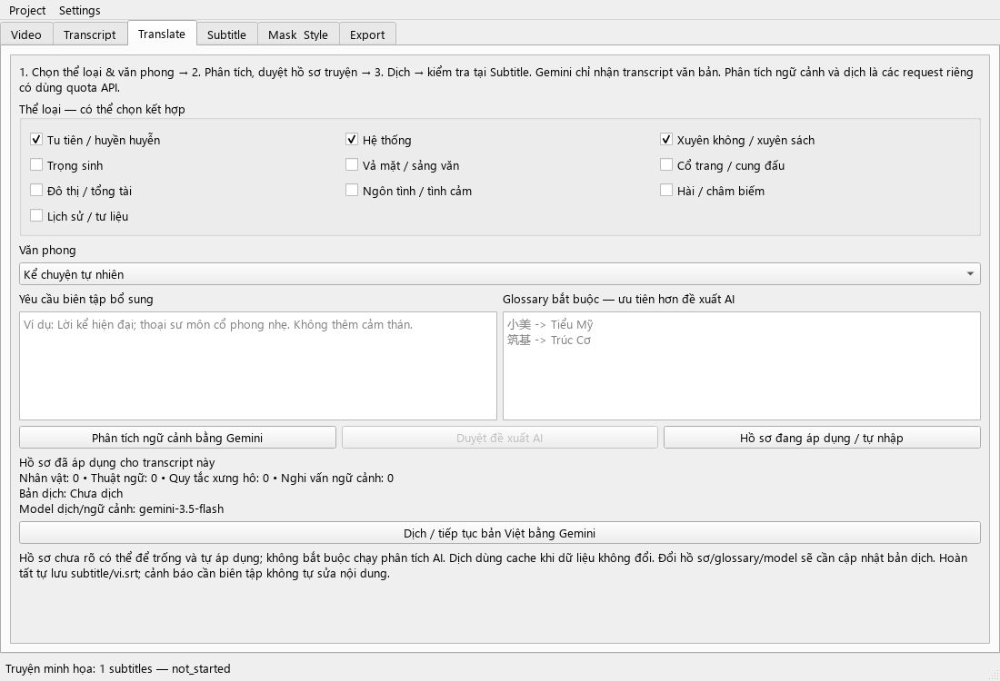
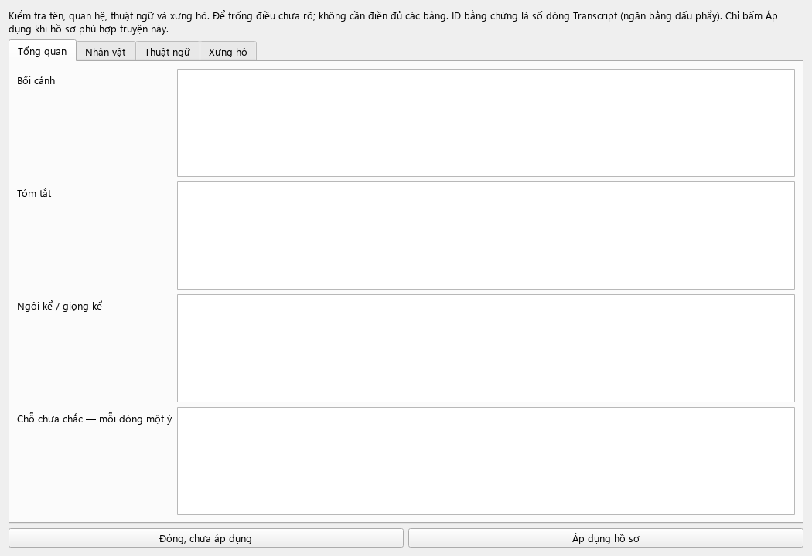

# Phase 3 — Biên dịch truyện Trung–Việt

## Thiết kế biên tập

Mục tiêu không phải làm mọi truyện nghe giống nhau. Bản dịch cần giữ giọng người kể, tình huống nhân vật, logic thế giới và nhịp kể, đồng thời đọc thành tiếng Việt tự nhiên. Preset là chỉ dẫn có điều kiện, không phải từ điển thay chữ.

Thứ tự ưu tiên: trung thành nguyên tác và hợp đồng ID → glossary người dùng → hồ sơ đã áp dụng → yêu cầu bổ sung → văn phong → thể loại. Khi xung đột hoặc thiếu bằng chứng, model phải ghi nghi vấn, không sáng tác để hợp preset.

### Các lớp ngữ cảnh

1. **Thể loại, chọn nhiều**: tu tiên/huyền huyễn; hệ thống; xuyên không/xuyên sách; trọng sinh; vả mặt/sảng văn; cổ trang/cung đấu; đô thị/tổng tài; ngôn tình; hài/châm biếm; lịch sử/tư liệu.
2. **Văn phong, chọn một**: kể chuyện tự nhiên; cổ phong tiết chế; kể chuyện nhịp nhanh; bám sát nguyên tác; tự sự kiểu Zhihu; thoại phim; thuyết minh tư liệu; tùy chỉnh.
3. **Hồ sơ truyện**: bối cảnh, tóm tắt, ngôi kể, tên/biệt danh, thuật ngữ, cặp xưng hô theo điều kiện, nghi vấn chưa xác định.
4. **Ngữ cảnh gần**: 5 câu trước, 5 câu sau, 5 bản dịch ngay trước nhóm hiện tại.

Không mặc định mọi truyện tu tiên đều xưng ta–ngươi. Không mặc định người xuyên không phải nói cổ phong. Không đổi xuyên không thành trọng sinh. Không biến vả mặt thành chửi tục. Không mặc định một tên nghe giống nữ chứng minh người nói là nữ. Không tự thay ngôi kể sang tôi để giống truyện Zhihu.

### Gợi ý phối hợp

| Nội dung | Thể loại chọn | Văn phong ban đầu |
|---|---|---|
| Nhân vật hiện đại xuyên vào giới tu tiên có hệ thống | Tu tiên + Hệ thống + Xuyên không | Kể chuyện tự nhiên |
| Trọng sinh trả thù, đảo ngược sự coi thường | Trọng sinh + Vả mặt | Kể chuyện nhịp nhanh |
| Môn phái, sư đồ, tranh đấu trong thế giới cổ đại | Tu tiên + Cổ trang | Cổ phong tiết chế |
| Tổng tài và đấu trí ở công ty | Đô thị + Vả mặt, thêm Ngôn tình nếu có | Kể chuyện tự nhiên |
| Video kể chuyện hoàng đế/chính sử pha hài | Lịch sử + Hài, nếu transcript phù hợp | Kể chuyện tự nhiên |

Đây là điểm bắt đầu, không phải phán định thể loại của video cụ thể. Chỉ chọn nhãn thật sự xuất hiện.

### Hồ sơ nhân vật và xưng hô

- Mỗi nhân vật: tên Trung/biệt danh, tên Việt, ghi chú thân phận và quan hệ, các ID bằng chứng.
- Mỗi thuật ngữ: từ Trung, cách dịch Việt, nghĩa/điều kiện dùng, ID bằng chứng.
- Mỗi quy tắc xưng hô: người nói, người nghe, từ xưng, từ gọi, điều kiện/thời điểm và ID bằng chứng.
- ID bằng chứng chứng minh nội dung nguồn; không tự chứng minh cách dịch tên là chính xác. Tên nghe sai từ ASR phải được đánh dấu để kiểm tra.
- Một nhân vật có thể xưng hô khác trước sư phụ và trước kẻ địch; có thể đổi cách gọi sau khi lộ thân phận. Ghi rõ điều kiện, không áp dụng thay thế hàng loạt.

Ví dụ glossary có chủ đích: `筑基 -> Trúc Cơ` khi đó là cảnh giới; `宿主 -> ký chủ` khi đó là cách hệ thống gọi nhân vật. Tool không tự điền hai mục này vào mọi truyện. Quy tắc thuật ngữ của người dùng được ưu tiên, nhưng cảnh báo đối chiếu chỉ là phép tìm chuỗi, có thể báo thừa ở câu dùng đại từ hoặc thành ngữ.

## Cách dùng

1. Đóng/mở lại tool. Mở project đã transcript thành công; không cần chạy transcript lần nữa.
2. **Settings → AI**: kiểm tra **Translation / context model**. Nếu còn `gemini-2.5-flash` từ bản cũ, chọn `gemini-3.5-flash` rồi Save. Chunk size mặc định 40, được chọn 30–50; retry mặc định 2. Tool giữ cấu hình người dùng, không tự đổi model đã lưu.
3. **Translate**: chọn các thể loại phù hợp và văn phong. Bắt đầu bằng Kể chuyện tự nhiên nếu chưa rõ.
4. Điền glossary bắt buộc và yêu cầu riêng nếu có. Có thể để trống.
5. Bấm **Phân tích ngữ cảnh bằng Gemini**. Tool đọc toàn bộ transcript thành batch ≤100 dòng/16.000 ký tự, cập nhật đề xuất tích lũy. Phân tích này có dùng quota Gemini riêng.
6. Bấm **Duyệt đề xuất AI**. Kiểm tra bốn tab Tổng quan, Nhân vật, Thuật ngữ, Xưng hô; sửa chỗ sai hoặc để trống thông tin chưa rõ. **Áp dụng hồ sơ** để chốt dùng cho bản dịch.
7. Có thể bỏ bước 5 và mở **Hồ sơ đang áp dụng / tự nhập**, tự điền hoặc giữ hồ sơ trống rồi Áp dụng. Khi đó chất lượng phụ thuộc chủ yếu glossary và ngữ cảnh gần.
8. Bấm **Dịch / tiếp tục bản Việt bằng Gemini**.
9. Xem song ngữ và cảnh báo tại **Subtitle**. Bảng hiện chỉ đọc; biên tập text/timestamp đầy đủ là Phase 4. Có thể chỉnh file SRT bên ngoài, nhưng lần Save/dịch tiếp theo sẽ xuất lại từ dữ liệu project.

Đề xuất AI mới không tự ghi đè hồ sơ đã áp dụng. Khi transcript thay đổi, tool yêu cầu kiểm tra và áp dụng hồ sơ cho transcript mới. Đổi thể loại/văn phong/glossary/hồ sơ khiến bản dịch cũ được đánh dấu cần cập nhật khi lưu hoặc bắt đầu tác vụ.

## Đầu ra

- `project.json`: hồ sơ áp dụng, bản đề xuất, trạng thái, subtitle song ngữ, ghi chú cần biên tập, trạng thái nhóm và hash.
- `subtitle/vi.srt`: bản Việt, giữ nguyên timestamp từ transcript.
- `subtitle/segments.json`: ID/start/end/zh/vi.
- `subtitle/translation_review.json`: trạng thái bản dịch, cảnh báo từng ID, các nghi vấn toàn truyện.

Cảnh báo gồm: bản dịch rỗng, chữ Trung còn sót, dòng trên 100 ký tự, tốc độ trên 22 ký tự/giây, glossary không khớp và ghi chú nghi vấn từ Gemini. Đây là ngưỡng tham khảo; không có cảnh báo không có nghĩa đã đảm bảo chính xác. Tool không tự sửa văn bản theo cảnh báo.

## Kiến trúc

- `context_models.py`: dữ liệu hồ sơ và schema.
- `presets.py`, `prompts.py`: quy tắc biên dịch thể loại/văn phong, phân cấp ràng buộc.
- `context_service.py`: đọc toàn bộ transcript theo batch, đề xuất hồ sơ có bằng chứng, không tự áp dụng.
- `chunker.py`: nhóm 30–50 dòng, giới hạn thêm 8.000 ký tự nên một nhóm có thể ít hơn; thêm tham chiếu gần.
- `gemini_translator.py`: validate kết quả đủ ID, không ID lạ/lặp; không nhận timestamp từ model. Model có thể trả thứ tự khác, backend ghép đúng ID.
- `requests.py`: lazy client, cache nguyên tử, retry lỗi API tạm thời hoặc JSON sai; chỉ gọi Google khi cache không dùng được.
- `pipeline.py`: orchestration, lưu tiến độ, cancel, giữ bản dịch cũ khi việc thay bản theo hồ sơ mới thất bại.
- `qc.py`, `artifacts.py`: cảnh báo local và export.
- `ui/context_dialog.py`, `ui/tabs/translate_tab.py`: biên tập hồ sơ và điều khiển workflow; không gọi Google trực tiếp.
- `ai/gemini_client.py`: adapter chung; Phase 3 chỉ gửi text, system instruction, JSON schema.

Cache request phụ thuộc model, system prompt, schema và toàn bộ payload (bao gồm hồ sơ, glossary, tham chiếu, bản dịch trước). Cache tiến độ nằm tại `cache/context/` và `cache/translation/`. Chỉnh font/mask không gọi lại AI. Thay nội dung có thể làm các nhóm sau cần dịch lại do ngữ cảnh nối tiếp thay đổi.

Dịch lần đầu lưu nhóm hoàn tất trong project để tiếp tục sau lỗi. Khi thay cấu hình cho bản dịch đã tồn tại, các nhóm mới lưu cache trước, chỉ thay trọn bản cũ sau khi hoàn tất; nếu hủy/lỗi, bản cũ vẫn còn. Không có transaction liên file: project là nguồn chính; nếu xuất SRT lỗi, Save project để xuất lại.

## Kiểm thử và giới hạn

Unit tests bao phủ project cũ, cấu trúc hồ sơ, bằng chứng ID, duyệt hồ sơ, đủ ID dịch, timestamp bất biến, tham chiếu liên nhóm, retry/resume/cancel, cache/style và giữ bản cũ khi lỗi. Smoke test dùng Qt offscreen, FFmpeg thật và phản hồi Gemini giả lập để kiểm tra luồng UI tới vi.srt. Chưa có đánh giá chất lượng dịch live theo nhiều thể loại bằng key người dùng.

Không có OCR/nhận diện người nói theo khuôn mặt: hồ sơ suy từ transcript, có thể sai. Phân tích tích lũy theo batch có thể bỏ sót chi tiết, cần duyệt hồ sơ. Chưa có bước LLM phê bình/dịch lại toàn bộ tự động, vì sẽ tăng chi phí và có thể ghi đè quyết định biên tập. Chưa có thư viện template dùng chung nhiều project; hồ sơ hiện lưu theo từng project.

Kiểm tra bản này: 31 unittest đạt; smoke test Qt/FFmpeg/ngữ cảnh/dịch/vi.srt đạt. SDK thật được kiểm tra tạo request qua HTTP transport giả lập, không dùng key thật.

